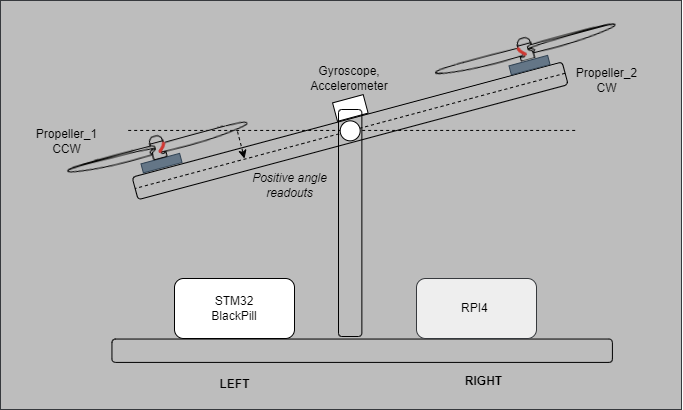

# FlyMatic Project Documentation Index

## Overview
FlyMatic is an drone project that integrates both software and hardware components to enable device to fly. This documentation provides detailed information on the repositories, project architecture and key functionalities.

## Prototypes revisions

### Proto 1
Pendulum with 2 motors, self balancing.  

### Proto 2
Chassis with 4 proppellers, self stabilizing.  
To be done in further steps.  

### Software Repositories :octicons-mark-github-24:
- [STM32 Firmware Repository](https://github.com/inpgbburda/Stm32f401.git): Contains the firmware for the STM32F4 microcontroller, including FreeRTOS and motor control logic.
- [Raspberry Pi Software Repository](https://github.com/TomBartDrone/drone_code.git): Contains the real-time Linux code for sensor data processing and communication.

### Hardware Repositories :octicons-mark-github-24: + :octicons-plug-24:
- [EE KiCad Project Repository](https://github.com/inpgbburda/FlyMaticEE.git): Contains schematics of electrical conntections.  

[Download - FlyMaticEE.pdf :material-download:](assets/FlyMaticEE.pdf){ .md-button }

## Project Architecture

