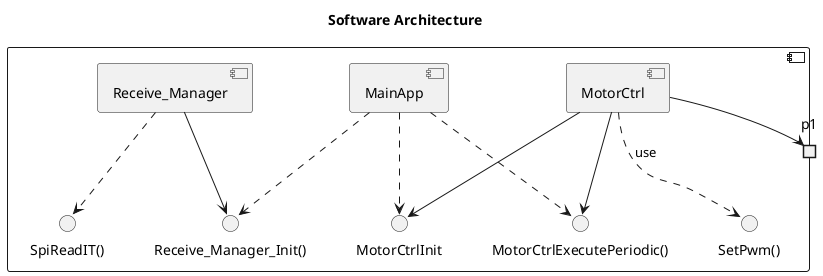
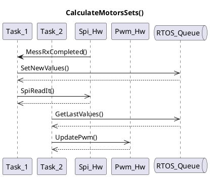
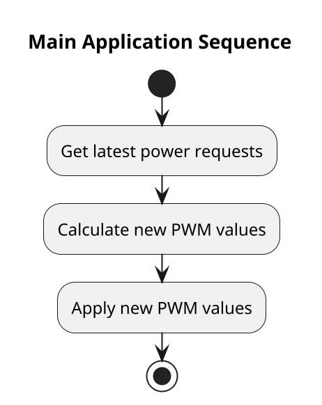

# Motor Control for Propulsion System

## Overview
This document outlines the control of electric motors that drive the drone's propellers. The motors are controlled using PWM signals, which are modulated to adjust the speed and direction of the propellers.

## Hardware Components
- **Motors:** RCX 1806 2400kV (Clockwise and Counterclockwise)
- **Motor Drivers:** Brushless ESC 20A 2-3S with a built-in BEC 2A

## Controlling Motor Drivers

### PWM Configuration
- **Frequency:** 50 Hz
- **Duty Cycle:** 5% (1ms) to 10% (2ms) (corresponding to minimum and maximum speed)

### Relationship Between PWM and Motor Speed
The PWM signal's duty cycle directly controls the motor speed. A higher duty cycle increases the speed, while a lower duty cycle decreases it.

### Practical Implementation
The PWM signals are generated by the STM32 microcontroller running FreeRTOS. The values are dynamically adjusted based on inputs from the accelerometer and gyroscope data.

## Related Sections
- [RTOS Configuration](rtos.md): For details on task scheduling related to motor control.

## Software solution

