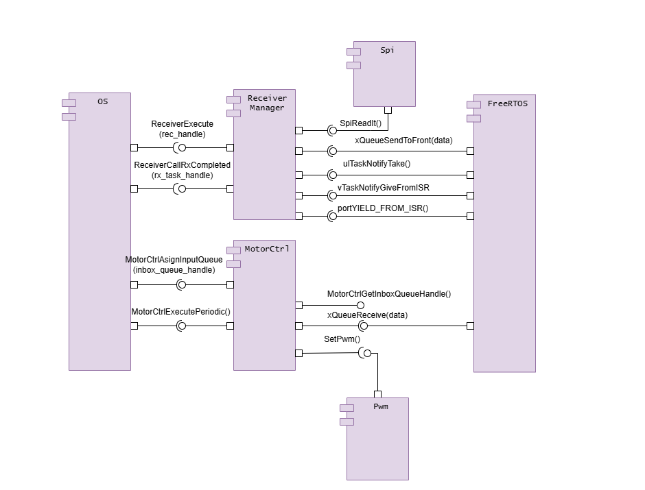

# Motor Control for Propulsion System

## Related Sections
- [AuxUnit - RTOS Configuration](aux_unit-rtos.md): For details on task scheduling related to motor control.

## Software solution

### Static Architecture

### Dynamic Architecture

### Detailed Design

