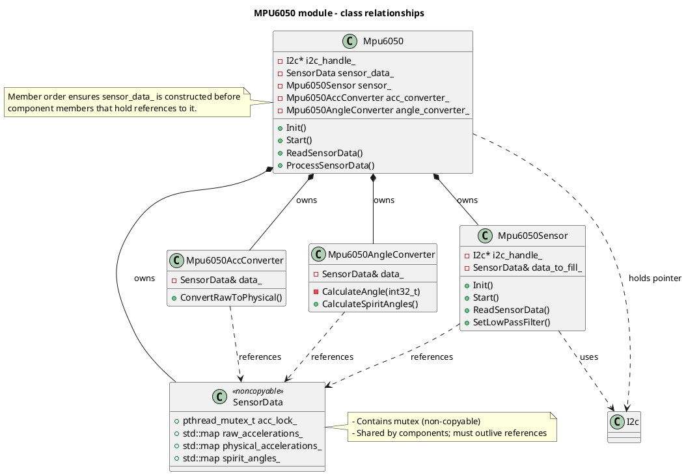
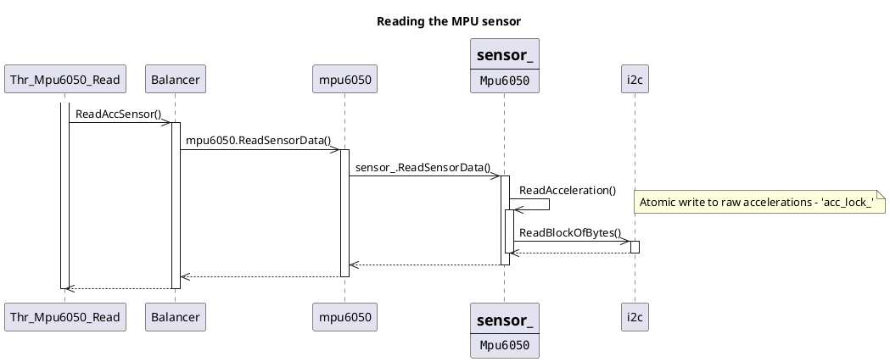
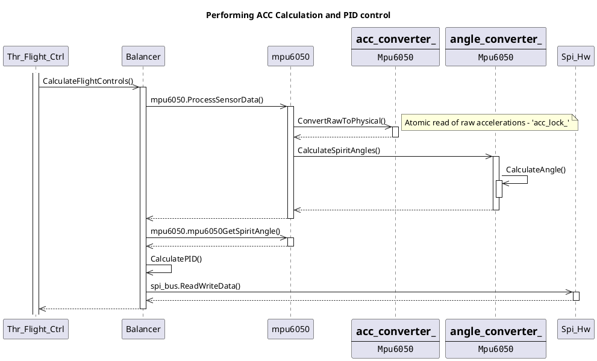

## Static Architecture

```puml
@startuml
title MPU6050 module - class relationships

class I2c

class SensorData <<noncopyable>> {
  + pthread_mutex_t acc_lock_
  + std::map raw_accelerations_
  + std::map physical_accelerations_
  + std::map spirit_angles_
}

class Mpu6050Sensor {
  - I2c* i2c_handle_
  - SensorData& data_to_fill_
  + Init()
  + Start()
  + ReadSensorData()
  + SetLowPassFilter()
}

class Mpu6050AccConverter {
  - SensorData& data_
  + ConvertRawToPhysical()
}

class Mpu6050AngleConverter {
  - SensorData& data_
  - CalculateAngle(int32_t)
  + CalculateSpiritAngles()
}

class Mpu6050 {
  - I2c* i2c_handle_
  - SensorData sensor_data_
  - Mpu6050Sensor sensor_
  - Mpu6050AccConverter acc_converter_
  - Mpu6050AngleConverter angle_converter_
  + Init()
  + Start()
  + ReadSensorData()
  + ProcessSensorData()
}

' Ownership / composition
Mpu6050 *-- SensorData : owns
Mpu6050 *-- Mpu6050Sensor : owns
Mpu6050 *-- Mpu6050AccConverter : owns
Mpu6050 *-- Mpu6050AngleConverter : owns

' Non-owning associations / references
Mpu6050Sensor ..> SensorData : references
Mpu6050AccConverter ..> SensorData : references
Mpu6050AngleConverter ..> SensorData : references

' I2C usage / dependency
Mpu6050 ..> I2c : holds pointer
Mpu6050Sensor ..> I2c : uses

note right of SensorData
  - Contains mutex (non-copyable)
  - Shared by components; must outlive references
end note

note left of Mpu6050
  Member order ensures sensor_data_ is constructed before
  component members that hold references to it.
end note

@enduml
```

## Dynamic Architecture

```puml
@startuml
title Reading the MPU sensor

participant "Thr_Mpu6050_Read"  as Thr_Mpu6050_Read
participant "Balancer"          as Balancer
participant "mpu6050"          as mpu6050
participant Mpu6050_sensor [
    =sensor_
    ----
    ""Mpu6050""
]
participant "i2c"               as i2c

activate Thr_Mpu6050_Read
Thr_Mpu6050_Read ->> Balancer : ReadAccSensor()
activate Balancer
Balancer ->> mpu6050: mpu6050.ReadSensorData()
activate mpu6050
mpu6050 ->> Mpu6050_sensor:         sensor_.ReadSensorData()
activate Mpu6050_sensor
Mpu6050_sensor ->> Mpu6050_sensor: ReadAcceleration()
note right: Atomic write to raw accelerations - 'acc_lock_'
activate Mpu6050_sensor
Mpu6050_sensor ->> i2c:             ReadBlockOfBytes()
activate i2c
i2c -->> Mpu6050_sensor
deactivate Mpu6050_sensor
deactivate i2c
Mpu6050_sensor -->> mpu6050
deactivate Mpu6050_sensor
mpu6050 -->> Balancer
deactivate mpu6050
Balancer -->> Thr_Mpu6050_Read:
deactivate Balancer
deactivate Thr_Mpu6050_Read

@enduml
```

```puml
@startuml
title Performing ACC Calculation and PID control

participant "Thr_Flight_Ctrl"   as Thr_Flight_Ctrl
participant "Balancer"          as Balancer
participant "mpu6050"          as mpu6050
participant Mpu6050_acc_converter [
    =acc_converter_
    ----
    ""Mpu6050""
]
participant Mpu6050_angle_converter [
    =angle_converter_
    ----
    ""Mpu6050""
]
participant "Spi_Hw"           as Spi_Hw

activate Thr_Flight_Ctrl
Thr_Flight_Ctrl ->> Balancer : CalculateFlightControls()
activate Balancer 
Balancer ->> mpu6050: mpu6050.ProcessSensorData()
activate mpu6050
mpu6050  ->> Mpu6050_acc_converter: ConvertRawToPhysical()
note right: Atomic read of raw accelerations - 'acc_lock_'
activate Mpu6050_acc_converter
Mpu6050_acc_converter -->> mpu6050
deactivate Mpu6050_acc_converter
mpu6050  ->> Mpu6050_angle_converter: CalculateSpiritAngles()
activate Mpu6050_angle_converter
Mpu6050_angle_converter ->> Mpu6050_angle_converter: CalculateAngle()
activate Mpu6050_angle_converter
deactivate Mpu6050_angle_converter
Mpu6050_angle_converter -->> mpu6050
deactivate Mpu6050_angle_converter
mpu6050 -->> Balancer
deactivate mpu6050
Balancer ->> mpu6050: mpu6050.mpu6050GetSpiritAngle()
activate mpu6050

mpu6050 -->> Balancer
deactivate mpu6050

Balancer ->> Balancer: CalculatePID()

Balancer ->> Spi_Hw: spi_bus.ReadWriteData()
activate Spi_Hw
Spi_Hw -->> Balancer
deactivate Spi_Hw

Balancer -->> Thr_Flight_Ctrl
deactivate Balancer

@enduml
```