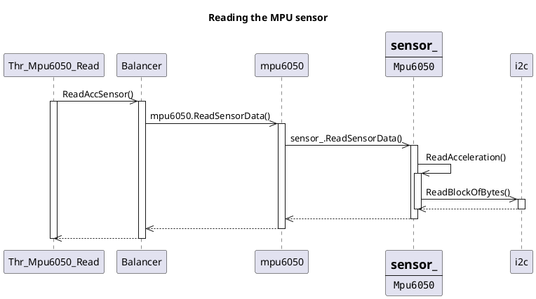
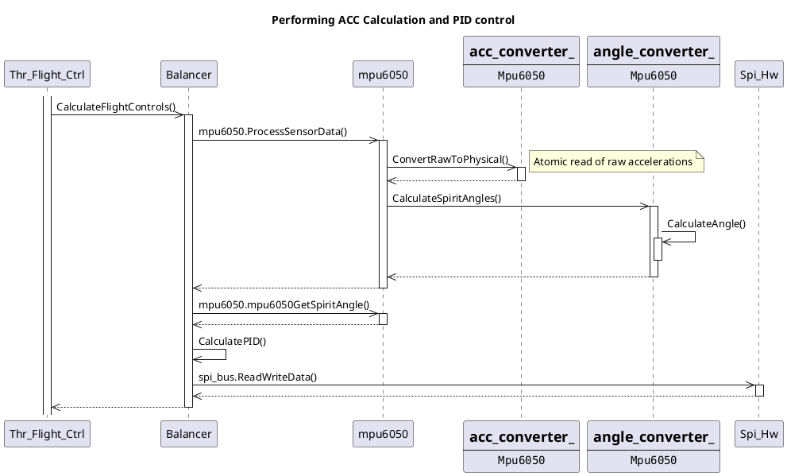

# Overview

The MainUnit is a master for all system logic and control.  
It's deployed on `RPI4B` board with OS:  

System name :simple-linux::  
- `Linux raspberrypi 6.6.31-rt30-v8+ #1 SMP PREEMPT_RT`
Hardware name:  
- `aarch64`

The OS is patched with `PREEMPT_RT` - more about here [linux_foundation_link](https://wiki.linuxfoundation.org/realtime/start#documentation).  
To avoid building kernel from scratch, pre-prepared version was built. [GitHub - remusmp/rpi-rt-kernel](https://github.com/remusmp/rpi-rt-kernel)

The most important feature of the `PREEMPT_RT` patch, is that it that **the scheduler can preemt almost every kernel operation**.  

As a consequence, the user (time critical) threads cam now treated with the higher priority.  
In most cases, it allows to achieve `100us` time resolution. More about it: [linux_doc_link](https://docs.kernel.org/next/core-api/real-time/theory.html)

### Dynamic Architecture

